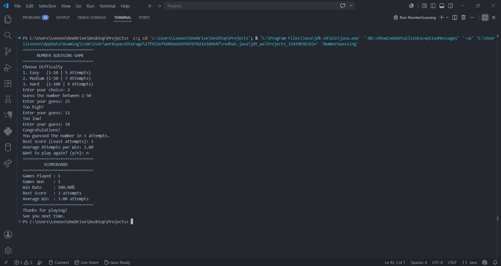

# 🎮 Java Number Guessing Game

A console-based Number Guessing Game built in Java to strengthen core programming concepts through a practical project.

---

## 📖 About

This project was developed while learning Java fundamentals with the goal of applying programming concepts to a complete console application. It focuses on writing structured, modular, and user-friendly code rather than simple practice programs.

---

## ✨ Features

- 🎯 Three difficulty levels (Easy, Medium, Hard)
- 🎲 Random number generation
- ✅ Input validation using exception handling
- 📊 Score tracking and win rate calculation
- 🏆 Best score tracking
- 📈 Average attempts per win
- 🔁 Replay functionality
- 🧩 Modular code using methods and constants

---

## 🛠️ Technologies Used

- Java
- Object-Oriented Programming (OOP)
- Java Collections
- Exception Handling
- Random Class
- Scanner Class

---

## 📂 Project Structure

```
```text
java-number-guessing-game
│
├── images
│   └── game-demo.png
├── src
│   └── NumberGuessing.java
├── README.md
├── LICENSE
└── .gitignore
```
```
## 📷 Project Preview


---

## 🚀 How to Run

1. Clone this repository.
2. Open the project in your preferred Java IDE.
3. Compile and run `NumberGuessing.java`.
4. Choose a difficulty level and start playing.

---

## 📚 Learning Outcomes

Through this project I strengthened my understanding of:

- Java fundamentals
- Methods and modular programming
- Input validation
- Exception handling
- Program flow control
- User interaction in console applications

---

## 🔮 Future Improvements

- Difficulty selection menu enhancements
- Timer-based gameplay
- Leaderboard with file storage
- GUI version using Java Swing or JavaFX

---

## 👨‍💻 Author

**Sudarshan More**

If you have any suggestions or feedback, feel free to connect with me on LinkedIn.
